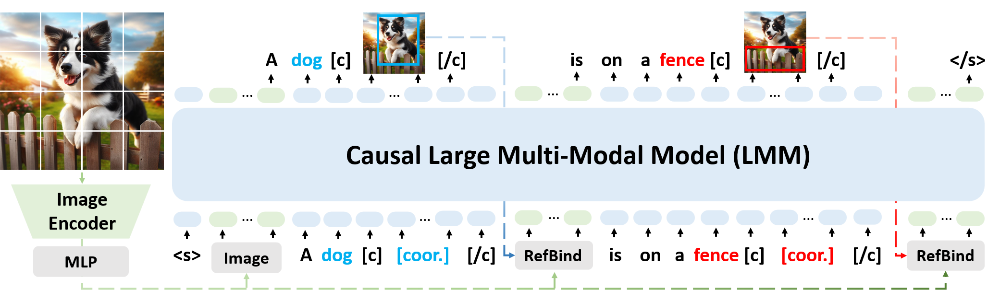

# 🌋VoCoT: Unleashing Visually Grounded Multi-Step Reasoning in Large Multi-Modal Models [[Paper](https://arxiv.org/abs/2405.16919)]
Exploring visually CoT reasoning in large multi-modal models with VoCoT!

[Zejun Li*](https://github.com/Junction4Nako), [Ruipu Luo*](https://github.com/RupertLuo), Jiwen Zhang, Minghui Qiu, Zhongyu Wei (*Equal Contribution)

We propose Visually grounded object-centric Chain-of-Thoughts (VoCoT) to support effective and reliable multi-step reasoning in large multi-modal models. For more details, please refer to our paper.

In this repository, we will release:
- The constructed VoCoT-Instruct data that can be use to train your multi-modal models to reason in the VoCoT format.
- VolCano model with the ability to perform multi-step reasoning in VoCoT.
- Training scripts utilized to train VolCano.
- Evaluation datasets and scripts used in our paper.

## Contents
- [Getting Started](#getting-started)
- [Data](#data)
- [Model Weights](#model-weights)
- [Train](#train)
- [Evaluation](#evaluation)

## Getting Started

### Install

1. Clone this repository
```bash
git clone https://github.com/RupertLuo/VoCoT.git
cd VoCoT
```

2. Install packages
```bash
conda create -n vocot python=3.9 -y
conda activate vocot
pip3 install --upgrade pip
pip3 install -r requirements.txt
pip3 install flash-attn --no-build-isolation
sudo apt-get install python3-tk -y 
```

### Quick Start

```python
from model.load_model import load_model, infer
from PIL import Image

# loading the model
model_path = '/mnt/bn/yangmin-priv/luoruipu/checkpoints/LLaVA-clip336px-obj-represent-Mistral-1e-5-3072-instruct_llava+shikraCoT75per+GPTQTA+lvis-cot/'
model, preprocessor = load_model(model_path, precision='fp16')

# perform reasoning, activate VoCoT by passing cot=True
input_image = Image.open('figs/sample_input.jpg')
response_1 = infer(model, preprocessor, input_image, 'Is there a event "the cat is below the bed" in this image?', cot=True)
response_2 = infer(model, preprocessor, input_image, 'Why is the cat on the bed?', cot=True)
response_3 = infer(model, preprocessor, input_image, 'Describe the image.', cot=True)
print('response 1: ', response_1[0])
print('response 2: ', response_2[0])
print('response 3: ', response_3[0])
```
Notice: in the default setting, the output coordinates is the box in the image which is expanded to square, not the original image. 

## Data

For users who want to use VoCoT-Instruct to train their own models, we provide a integrated json file, [VoCoT-Instruct-80K]() following the conversation format of LLaVA (Notice that all coordinates are for the images that are expanded to square).

If you would like to follow the training of VolCano in this paper, please use the separate json files in the [raw_data]() for efficient dataset management.

For the corresponding images, please visit [GQA](https://cs.stanford.edu/people/dorarad/gqa/about.html), [COCO](https://cocodataset.org/), and [LVIS](https://www.lvisdataset.org/) to download the images.

## Model Weights

The VolCano model is based on Mistral-Instruct-v0.2-7B and CLIP-14/L, the connection the trained weights are released [here](). The architecture is illustrated below and details are included in our paper.

<p align="center">
    <br>
    The architecture of VolCano.
</p>

## Train

In each stage, you prepare the data and pre-trained checkpoints with the help of following instructions:

### Prepare the Data

The datasets are managed with yaml files in [config/datasets](./config/datasets/). In each yaml, you need to make sure all the paths with "PATH/TO" in them are correctly prepared. 

For datasets that are either introduced, modified, or filtered in this paper, e.g. VoCoT-Instruct, the subset of GRIT and MMC4, we provide the meta data in [here](). 

For public datasets like RefCOCO, LLaVA, and ALLaVA, please refer to the corresponding websites to obtain the data. 
If it is not clear where to obtain the dataset, feel free to contact us.

### Conduct Training

We manage the experiment settings with yaml files in [config/experiments](./config/experiments/). In each yaml, set the paths with "PATH/TO" to your correct paths.

Every stage can be launched with (replace the yaml path with corresponding paths):

```bash
# modify the torchrun config to fit your machine
torchrun --nproc_per_node=8 train_volcano.py --conf config/experiments/stage1_alignment.yaml
```

## Evaluation
Please see [Evaluation](./eval/Evaluation.md) for details about the evaluation datasets and evaluation scripts.

## Acknowledgement
We thank the following open-source resources which we referenced during the development of VoCoT.

- [LLaVA](https://github.com/haotian-liu/LLaVA): our codebase is built on LLaVA and LLaVA-Instruct is adopted during the training.
- [Shikra](https://github.com/shikras/shikra): we follow Shikra for the construction of GQA Type-1 VoCoT-Instruct data. 
- [InstructDiffusion](https://github.com/cientgu/InstructDiffusion): we referenced InstructDiffusion codebase to manage multiple datasets.


## Citation

If you find our code, data, or model useful during your work, please consider citing our work:
```bibtex
@article{li2024vocot,
  title={VoCoT: Unleashing Visually Grounded Multi-Step Reasoning in Large Multi-Modal Models},
  author={Li, Zejun and Luo, Ruipu and Zhang, Jiwen and Qiu, Minghui and Wei, Zhongyu},
  journal={arXiv preprint arXiv:2405.16919},
  year={2024}
}
```
